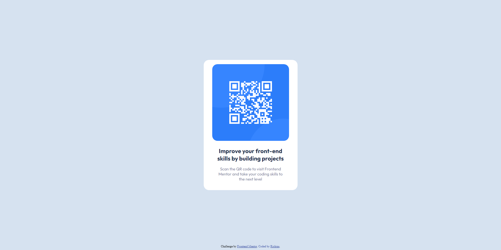

# Frontend Mentor - QR code component solution

This is a solution to the [QR code component challenge on Frontend Mentor](https://www.frontendmentor.io/challenges/qr-code-component-iux_sIO_H). Frontend Mentor challenges help you improve your coding skills by building realistic projects. 

## Table of contents

- [Overview](#overview)
  - [Screenshot](#screenshot)
  - [Links](#links)
- [My process](#my-process)
  - [Built with](#built-with)
  - [What I learned](#what-i-learned)
  - [Continued development](#continued-development)
  - [Useful resources](#useful-resources)
- [Author](#author)
- [Acknowledgments](#acknowledgments)

**Note: Delete this note and update the table of contents based on what sections you keep.**

## Overview
  I've always looked for small projects to practice new ideas. I chose this project on FrontEnd Mentor simply because I could test a pattern called CSS Utility, which consists of creating classes for specific things like text color and size, background color.
### Screenshot



### Links

- Solution URL: [Add solution URL here](https://your-solution-url.com)
- Live Site URL: [Add live site URL here](https://your-live-site-url.com)

## My process

First I started in the standard way. My initial idea was just to recreate what was in figma. However, when I was structuring the html I had the idea of ​​applying this concept of Utility CSS in the project, considering that I found this way of working very useful.

I also overcame a big hurdle that I always have when doing frontend projects. I don't know the right and ideal way to do things, so I was always frustrated, things like not knowing whether to use a <div> or a <section>, I decided to do it the way I thought was right for me.

I hope to be able to work on larger scope projects in the future and revisit unfinished projects of mine.

### Built with

- Semantic HTML5 markup
- CSS custom properties
- Flexbox

### What I learned

A good example of css utility application. It's pretty simple, if you think about it, but extremely powerful, because with just a few words you can change the appearance of objects on the page.

``html
 <div class="qr-page-wrapper qr-bg-light-gray">
      <div class="qr-card qr-bg-white"> (...)
```
```css
.qr-bg-light-gray {
    background-color: hsl(212, 45%, 89%);
}

qr-bg-grayish-blue {
    background-color: hsl(220, 15%, 55%);
}

qr-bg-dark-blue {
    background-color: hsl(218, 44%, 22%);
}

```

```


### Continued development

Amazingly. I've been studying programming since I was 15 (Currently, as I write this I'm 19 years old), my focus has always been on games, of course, but back to the subject. This is my first project that I complete, as simple as it is, I am very proud of it.
I hope I can do well with pure html and css,
I'm going to implement this idea of ​​CSS utility in all my projects in order to always practice it.

### Useful resources

- [Example resource 1](https://www.example.com) - It was in this course that I learned and saw the CSS utility for the first time, it was the first course I took after 1 year studying Front End.
- [Example resource 2](https://blog.logrocket.com/css-utility-classes-library-extendable-styles/) - This article helped me a lot in figuring out how I should work with utility css.

## Author

- Website - [Rickras](https://github.com/Rickrasin/Rickrasin)
- Frontend Mentor - [@Rickrasin](https://www.frontendmentor.io/profile/Rickrasin)
- Twitter - [@yourusername](https://www.twitter.com/yourusername)

